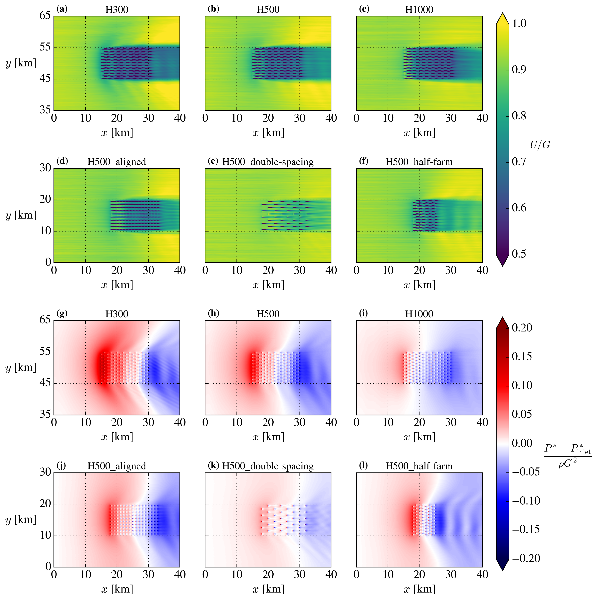
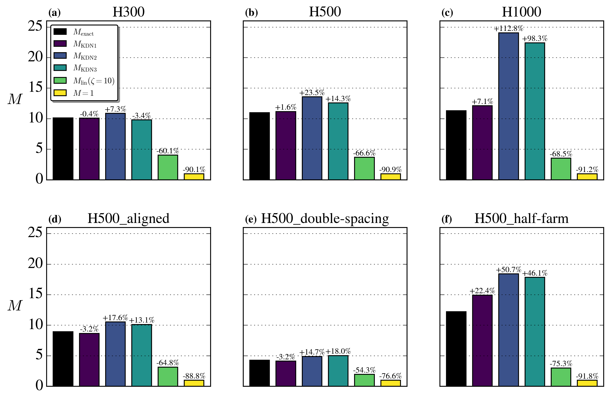
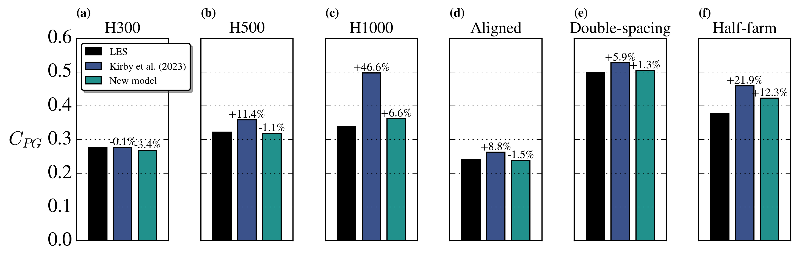

# Validation-and-extension-of-an-analytic-momentum-availability-model

Post-processed data and plotting scripts used by [Baungaard et. al, 2026](https://arxiv.org/abs/2602.10126)[1](#Baungaard2025). 

## LES data

The raw LES data are availabile at [Lanzilao & Meyers (2024)](https://doi.org/10.48804/L45LTT) and [Lanzilao & Meyers (2025)](https://doi.org/10.48804/LRSENQ). There are around 1.1 and 2.0 billion grid points in each of the 2024 and 2025 simulations, respectively. This means that file size of the time-averaged first-order statistics of one simulation is 40 and 74 GB, respectively.

## Post-processed data

A subset of the LES data (0.9 GB and 1.4 GB for the 2024 and 2025 cases, respectively) relevant for the current work can be downloaded from [Zenodo](https://zenodo.org/records/18458892).

## Plots

## References

<a name="Baungaard2026">[1]</a> M. Baungaard, T. Nishino & A. Kirby (2026), [*Validation and extension of an analytic momentum availability model for the two-scale momentum theory of wind farm flows*](https://arxiv.org/abs/2602.10126), arXiv preprint.
