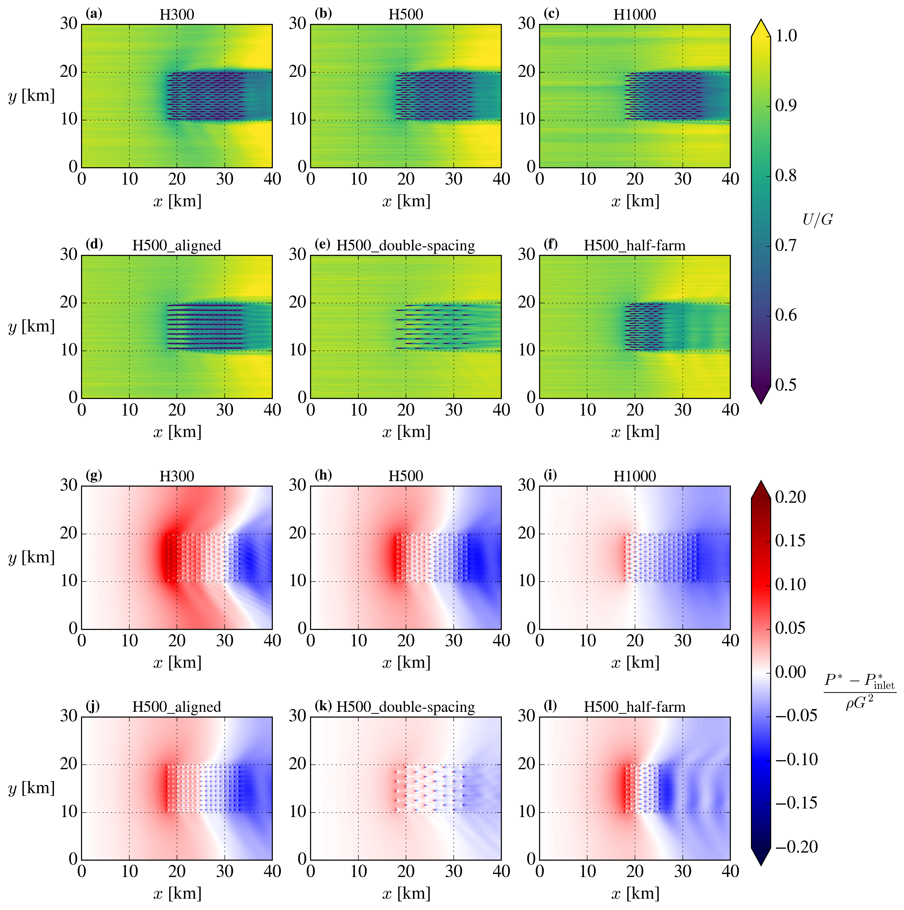
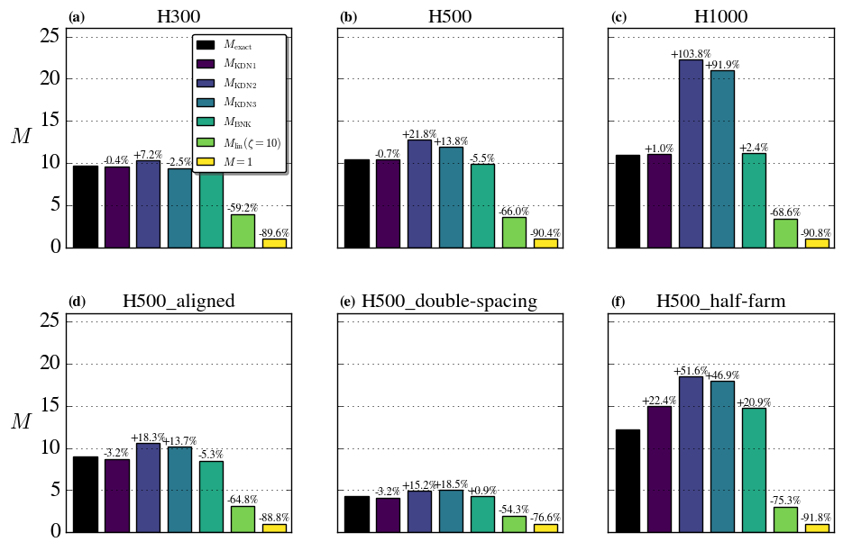
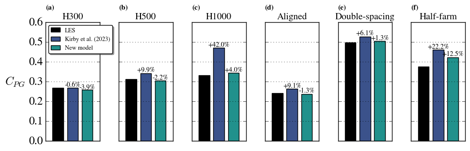

# Validation-and-extension-of-an-analytic-momentum-availability-model

Post-processed data and plotting scripts used by Baungaard et. al (2026). 

## LES data

The raw LES data are availabile at [Lanzilao & Meyers (2024)](https://doi.org/10.48804/L45LTT). There are around 1.1 billion grid points in the simulations, which means that the file size of a single snapshot (e.g. the pressure field) is around 40 GB.

## Post-processed data

A subset of the LES data (around 3 GB) relevant for the current work can be downloaded from [Zenodo](https://zenodo.org/records/18458892).

## Plots

## References

